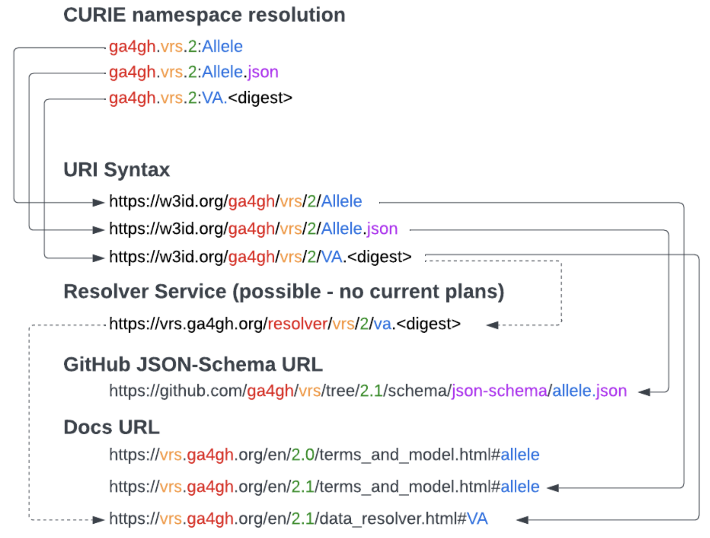

.. _design_decisions:

Design Decisions
!!!!!!!!!!!!!!!!

The following design decisions were made in the development of the VRS:

GA4GH Inherent Properties over Value Objects
@@@@@@@@@@@@@@@@@@@@@@@@@@@@@@@@@@@@@@@@@@@@

In VRS 1.0 we operated under the principle that all identifiable objects in VRS (e.g. Allele, SequenceLocation, etc.)
would be *value objects*. This meant that they should be immutable and contain only required fields that are
necessary to uniquely identify the object. This approach somewhat simplified the ability to generate the digests by
allowing the computation of the digest to be based on the entire object. An exception was made for properties with a
leading underscore (namely, the *_id* property), which was removed from the object before a digest was calculated.

In VRS 2.0 we extended the principle of excepting designated attributes by explicitly defining *inherent properties*
that constitute the properties used to compute an object digest. This was done to enable expressivity of VRS,
enabling implementations to pass common, descriptive metadata as part of the identifiable objects without sacrificing
the ability to create globally unique, federated identifiers from VRS 1.3.

As a result, we had to introduce a new field in the digest model called *ga4gh.inherent* which is described in detail
in the section on :ref:`ga4gh-inherent-properties`.

IRIs over CURIEs
@@@@@@@@@@@@@@@@

In VRS 2.0 we moved away from the use of CURIEs in favor of :ref:`iriReference`. Several factors played a role in
this decision.

JSON Schema, the default data model for GKS specifications, does not allow for encoding of CURIE namespaces as is done
in other frameworks such as JSON-LD or XML. As a result, namespaces must be captured from custom data structures, API
endpoints, or documentation that may not persist as messages are exchanged between systems. To address this, references
in GKS specs now use IRIs to reference objects explicitly.

IRI-References over IRIs
@@@@@@@@@@@@@@@@@@@@@@@@

We opted for the general use of IRI-References as a way to provide a more flexible approach to the use of IRIs
in most GKS message structures. IRI-references (relative IRIs) benefit the users allow for compact representation
of concepts that are accessible within a system (e.g. a directory structure or web API).

VRS identifier syntax and versioning
@@@@@@@@@@@@@@@@@@@@@@@@@@@@@@@@@@@@

The :ref:`versioning` section describes the versioning and release naming conventions for the VRS product.
Approved releases will be assigned to the version number alone, but connect, ballot and snapshot releases will
include the context term and date in addition to the target version number.

During the GA4GH Connect April 2023 meeting the maturity model was discussed at length and the following
proposal was presented for instance and class GKS identifiers.

As an example, the Github JSON Schema URL ($id) for the VRS 2.0.0 Allele is:

.. code-block:: json

  {
    "$schema": "https://json-schema.org/draft/2020-12/schema",
    "$id": "https://w3id.org/ga4gh/schema/vrs/2.0.0/json/Allele",
    ...
  }

During the **release and versioning** discussion at the GA4GH Connect April 2023 meeting the proposal
delved into the idea of including the major version number in the VRS identifier itself. Proponents of
this approach cited concern for the change in digests (and their derived identifiers) between major
versions of the same VRS object, which would become clearly visible in the identifier itself if the
major version was included.

Opponents of this approach argued that new identifiers would be required for every type of VRS object
for every major version release. Meaning that even if a given type of object has no change that would
result in a new digest, a new identifier would still be required for the new major version.

After much discussion, the decision was made to NOT include the major version number in the VRS identifier
itself. Therefore, the :ref:`identifier-construction` does NOT contain the version number, resulting in
the following syntax:

**CURIE namespace resolution**

.. code-block::

  ga4gh:VA.Oop4kjdTtKcg1kiZjIJAAR3bp7qi4aNT

**URI Syntax**

.. code-block::

  https://w3id.org/ga4gh/vrs/VA.Oop4kjdTtKcg1kiZjIJAAR3bp7qi4aNT

Use of value sets for VRS computed digests
@@@@@@@@@@@@@@@@@@@@@@@@@@@@@@@@@@@@@@@@@@

The GKS Core model contains a ``MappableConcept`` data model which is usable in 
places where one would expect general, externally-defined concepts such as 
genes, diseases, or therapeutics. In VRS, we intentionally define value sets
instead of using the ``MappableConcept`` model in places where such concepts are 
used in calculated a computed digest. 

For example, the :ref:`CopyNumberChange` model has a ``copyChange`` field that 
describes whether the variant `Location` is systematically observed as a low-level 
or high-level gain or loss. These concepts, though defined in the Experimental Factor 
Ontology, are maintained internally such that changes to these concepts in EFO will 
not affect their use in VRS (and therefore not affect the computed digests of 
CopyNumberChange objects).
