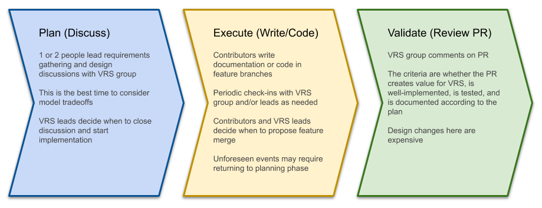

Development Process
@@@@@@@@@@@@@@@@@@@

.. _release-cycle:

Release Cycle
#############

   The VRS development process.

The release cycle is implemented in the `VR project board`_, which is
the authoritative source of information about development status.

Planned Features
$$$$$$$$$$$$$$$$
Feature requests from the community are made through the generation of
`GitHub issues on the VRS repository`_, which are open for
public review and discussion.

Project Leadership Review
$$$$$$$$$$$$$$$$$$$$$$$$$
Open issues are reviewed and triaged by the :ref:`Project Leadership
<project-leadership>`. Feature requests identified to support an unmet
need are added to the `Backburner`_ project column and scheduled for
discussion in our weekly VR calls. These discussions are used to inform
whether or not a feature will be planned for development. The :ref:`Project
Maintainers <project-maintainers>` are responsible for making the
final determination on whether or not a feature should be added to VRS.

Requirements Gathering
$$$$$$$$$$$$$$$$$$$$$$
Once a planned feature is introduced in call, the issue moves to the
`Planning`_ project column. During this phase, community feedback on use
cases and technical requirements will be collected (see `example
requirement issues`_). Deadlines for submitting cases will be set by the
Project Maintainers.

Requirements Discussion
$$$$$$$$$$$$$$$$$$$$$$$
Once the requirements gathering phase has been completed, the issue
moves to the `Backlog/Ready for Dev`_ project column. In this phase,
the requirements undergo review and discussion by the community on
VR calls.

Feature Development
$$$$$$$$$$$$$$$$$$$
After community review of requirements, the issue moves on to the
`In Progress`_ project column. In this stage, the draft features
will be developed as a draft `Pull Request`_ (PR). The draft author will
indicate that a feature is ready for community review by marking the
PR as "Ready for review" (at which point the PR loses "draft" status).

Feature Review
$$$$$$$$$$$$$$
Once a PR is ready for review, the Project Maintainers will move the
corresponding issue to the `QA/Feedback`_ project column.  Pull
requests ready for public review MAY be merged into the `main` (stable
release) branch through review and approval by at least one
(non-authoring) Project Maintainer. Merged commits MAY be tagged as
alpha releases when needed. After merging, corresponding issues are
moved to the `Done`_ project column and are closed.

Version Review and Release
$$$$$$$$$$$$$$$$$$$$$$$$$$
After completion of all planned features for a new minor or major
version, a request for community review will be indicated by a beta
release of the new version. Community stakeholders involved in the
feature requests and requirements gathering for the included features
are notified by Project Maintainers for review and approval of the
release. After a community review period of at least one week, the
Project Leadership will review and address any raised concerns for the
reviewed version.

After passing review, new minor versions are released to
production. If any features in the reviewed version are deemed to be
significant additions to the specification by the Project Leadership, or if
it is a major version change, instead a release candidate version will
be released and submitted for GA4GH product approval. After approval,
the new version is released to production.

VRS follows `GA4GH project versioning recommendations
<https://docs.google.com/document/d/1UUJSnsPw32W5r1jaJ0vI11X0LLLygpAC9TNosjSge_w/edit#heading=h.6672fcrbpqsk>`__,
based on `Semantic Versioning 2.0 <http://semver.org/>`_. 

Leadership
##########

.. _project-leadership:

Project Leadership
$$$$$$$$$$$$$$$$$$
As a product of the Genomic Knowledge Standards (GKS) Work Stream,
project leadership is comprised of the `Work Stream leadership`_:

* Alex Wagner (`@ahwagner <https://github.com/ahwagner>`__)
* Andy Yates (`@andrewyatz <https://github.com/andrewyatz>`__)
* Bob Freimuth (`@rrfreimuth <https://github.com/rrfreimuth>`__)
* Javier Lopez (`@javild <https://github.com/javild>`__)
* Larry Babb (`@larrybabb <https://github.com/larrybabb>`__)
* Matt Brush (`@mbrush <https://github.com/mbrush>`__)
* Reece Hart (`@reece <https://github.com/reece>`__)

.. _project-maintainers:

Project Maintainers
$$$$$$$$$$$$$$$$$$$
Project maintainers are the leads of the GKS Variation Representation working group:

* Alex Wagner (`@ahwagner <https://github.com/ahwagner>`__)
* Larry Babb (`@larrybabb <https://github.com/larrybabb>`__)
* Reece Hart (`@reece <https://github.com/reece>`__)

.. _VR project board: https://github.com/orgs/ga4gh/projects/5?card_filter_query=repo%3Aga4gh%2Fvrs
.. _Backburner: https://github.com/orgs/ga4gh/projects/5?card_filter_query=repo%3Aga4gh%2Fvrs#column-9024746
.. _Planning: https://github.com/orgs/ga4gh/projects/5?card_filter_query=repo%3Aga4gh%2Fvrs#column-8939340
.. _Backlog/Ready for Dev: https://github.com/orgs/ga4gh/projects/5?card_filter_query=repo%3Aga4gh%2Fvrs#column-5274081
.. _Pull Request: https://github.com/ga4gh/vrs/pulls
.. _In Progress: https://github.com/orgs/ga4gh/projects/5?card_filter_query=repo%3Aga4gh%2Fvrs#column-5274078
.. _QA/Feedback: https://github.com/orgs/ga4gh/projects/5?card_filter_query=repo%3Aga4gh%2Fvrs#column-8087350
.. _Done: https://github.com/orgs/ga4gh/projects/5?card_filter_query=repo%3Aga4gh%2Fvrs#column-5274079
.. _GitHub issues on the VRS repository: https://github.com/ga4gh/vrs/issues
.. _example requirement issues: https://github.com/ga4gh/vrs/labels/requirements
.. _Work Stream leadership: https://ga4gh-gks.github.io/
