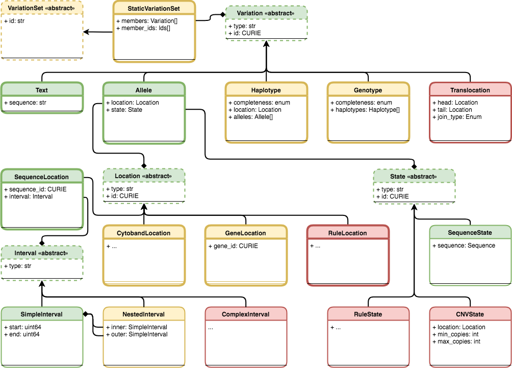

Future Plans
!!!!!!!!!!!!

   **An illustration of planned components for the VR Schema.** Version 1.0 components are colored green. Components that are undergoing testing and evaluation and are candidates for the next release cycle are colored yellow. Components that are planned but still undergoing requirement gathering and initial development are colored red. The VR Schema requires the use of multiple composite objects, which are grouped under four abstract classes: :ref:`Variation`, :ref:`Location`, :ref:`State`, and :ref:`Interval`. These classes and their relationships to the representation of Variation are illustrated here. All classes have a string type. Dashed borders denote abstract classes. Abstract classes are not instantiated. Thin solid borders denote classes that may be instantiated but are not identifiable. Bold borders denote identifiable objects (i.e., may be serialized and identified by computed identifier). Solid arrow lines denoted inheritance. Subclasses inherit all attributes from their parent. Inherited attributes are not shown.

.. _var-sets:

Variation Sets
@@@@@@@@@@@@@@

Planned Variation Concepts
@@@@@@@@@@@@@@@@@@@@@@@@@@

Haplotypes
##########

Genotypes
#########

Translocations
##############

.. _planned-locations:

Planned Location Concepts
@@@@@@@@@@@@@@@@@@@@@@@@@

CytobandLocation
################

GeneLocation
############

LocationRule
############

.. _planned-states:

Planned State Concepts
@@@@@@@@@@@@@@@@@@@@@@

CNVState
########

StateRule
#########

.. _planned-intervals:

Planned Interval Concepts
@@@@@@@@@@@@@@@@@@@@@@@@@

ComplexInterval
###############

.. _non-sequence-variation:

Non-sequence Variation
######################
