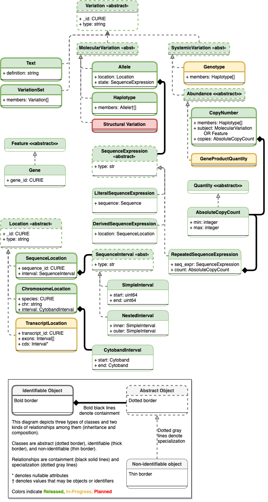

.. _future-plans:

Future Plans
!!!!!!!!!!!!

Overview
@@@@@@@@

VRS covers a fundamental subset of data types to represent
variation, thus far predominantly related to the replacement of a
subsequence in a reference sequence. Increasing its applicability will
require supporting more complex types of variation, including:

* genotypes
* structural variation
* mosaicism and chimerism
* categorical variation

   Planned Variation Representation Specfication Schema

   See :ref:`Current schema diagram <vr-schema-diagram>` for legend.

   Existing classes are colored green. Components that are
   undergoing testing and evaluation and are candidates for the next
   release cycle are yellow. Components that are planned but
   still undergoing requirement gathering and initial development are
   colored red.

   [`source
   <https://app.diagrams.net/#G1Qimkvi-Fnd1hhuixbd6aU4Se6zr5Nc1h>`__]

The following sections provide a preview of planned concepts under way
to address a broader representation of variation.

.. _planned-locations:

Intervals and Locations
@@@@@@@@@@@@@@@@@@@@@@@

VRS uses :ref:`Location` subclasses to define where variation occurs.
The schema is designed to be extensible to new kinds of Intervals and
Locations in order to support, for example, fuzzy coordinates or
feature-based locations.

ComplexInterval
###############

Representation of complex coordinates based on relative locations or
offsets from a known location. Examples include "left of" a given
position and intronic positions measured from intron-exon junctions.

**Computational definition**

Under development.

**Information model**

Under development.

.. _planned-variation:

Variation Classes
@@@@@@@@@@@@@@@@@

Additional :ref:`Variation` concepts that are being planned for future
consideration in the specification. See :ref:`Variation` for more
information.

Structural Variation
####################

.. note:: This concept is being refined. Please comment at https://github.com/ga4gh/vrs/issues/103

The aberrant joining of two segments of DNA that are not typically
contiguous.  In the context of joining two distinct coding sequences,
translocations result in a gene fusion, which is also covered by this
VRS definition.

**Computational definition**

A joining of two sequences is defined by two :ref:`Location` objects
and an indication of the join "pattern" (advice needed on conventional
terminology, if any).

**Information model**

Under consideration. See https://github.com/ga4gh/vrs/issues/28.

**Examples**

t(9;22)(q34;q11) in BCR-ABL

.. _GitHub issue: https://github.com/ga4gh/vrs/issues
.. _genetic variation: https://en.wikipedia.org/wiki/Genetic_variation

.. _planned-variation-sets:

Categorical Variation
@@@@@@@@@@@@@@@@@@@@@

Some variations are defined by categorical concepts, rather than specific
locations and states. These variations go by many terms, including
*categorical variants*, *bucket variants*, *container variants*, or
*variant classes*. These forms of variation are not described by any
broadly-recognized variation format, but modeling them is a key requirement
for the representation of aggregate variation descriptions as commonly
found in biomedical literature. Our future work will focus on the formal
specification for representing these variations with sets of rules, which
we currently call *Categorical Variation*.

