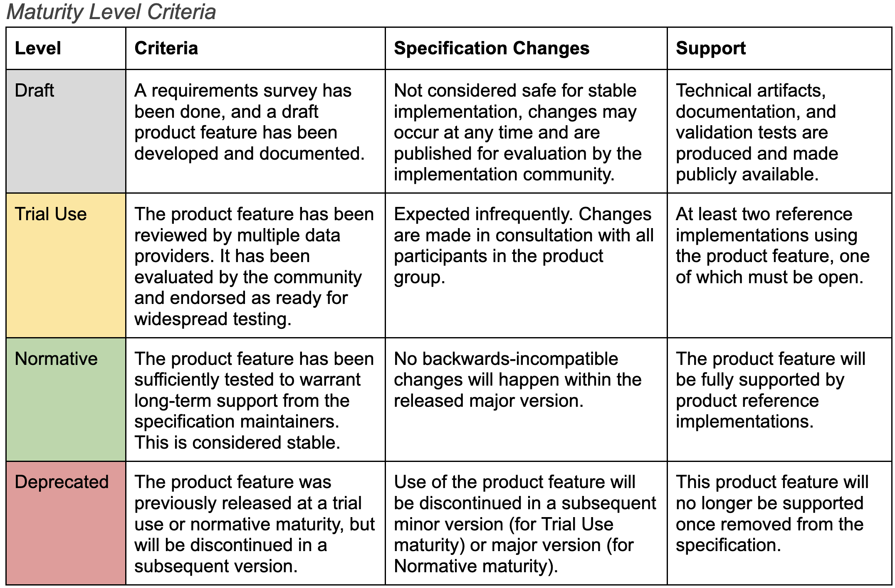

.. _maturity-model:

GKS Maturity Model
!!!!!!!!!!!!!!!!!!

The Genomic Knowledge Standards work stream is developing semantic data exchange 
standards for federated genomic knowledge sharing. To address this, new technical 
specifications are required, such as the VRS standard, which must be developed 
and iterated upon through application across community implementations. This 
creates a tension between the need to create products with enough stability for 
initial community adoption, while ensuring that they can evolve with minimal 
disruption to interoperate smoothly across a diverse set of genomic knowledge 
resources. Mechanisms for communicating the stability, uptake, and development 
of technical specifications are therefore of paramount importance to addressing 
this balance.

A maturity model is a useful mechanism for communicating varying stability across 
product features (e.g. data classes or protocols) of a GKS standard. This is 
needed to help data producers at each stage of the adoption lifecycle 
decide on the appropriate time to engage and implement the standard. Product 
features that have progressed through the maturity model should have an associated 
progression of support from the GKS specification maintainers for message 
generation, translation, and validation tooling.

Here we define the maturity model and release process for developing and 
maintaining GKS standards, with the goal of enabling  timely specification 
adoption by the community.

.. figure:: ../images/adoption_lifecycle.png
    :width: 800

    The Innovation Adoption Lifecycle. 
    
    *The Innovation Adoption Lifecycle illustrates adoption rates (y-axis) for 
    new technologies over time (x-axis). Innovators (leftmost on the time axis) 
    are among the first to adopt a new technology, and laggards (rightmost) are 
    among the last, reflecting the differing needs for innovation and stability 
    by these community groups. Adopters in every category along the innovation 
    adoption lifecycle benefit from communication about the maturity of technical 
    specification components generated by the Genomic Knowledge Standards work 
    stream. Communicating when a component is ready for implementation by groups 
    along the innovation / stability spectrum is a primary goal of the maturity 
    model, enabling adopters to engage at a time that is appropriate for their 
    organizational needs.*

Feature Maturity levels
@@@@@@@@@@@@@@@@@@@@@@@

    Product feature maturity level criteria and commitments.

Product feature maturity levels are to be reviewed and advanced by consensus among 
defined decision-makers following Work Stream and GA4GH processes, in consultation 
with the associated product group membership. Factors to be considered for product 
feature maturity advancement include the criteria specified in the above table, the 
degree of adoption observed in the community, feedback provided by adopters, and 
availability of specification maintainers to provide the level of support required.

Developing a Draft Product Feature
##################################

**Decision-makers**: :ref:`feature-developers`, :ref:`product-leads`

**Criteria**: Draft product feature development work should be based on real use 
cases across multiple environments (aligned with `GA4GH Product Development 14.5`_). 
Requirements may result directly from a `landscape analysis of the problem domain`_, 
or may emerge in the course of technical specification development. It is expected 
that the need for product features are first discussed in a community forum (e.g. 
GitHub Discussions, GKS Work Stream calls).

**Process**: Follow the GKS :ref:`development-process`. As part of this process, 
it is expected that consensus among the decision-makers was reached and major design 
decisions documented. Disagreements are resolved per Work Stream and GA4GH processes.

Advancing from Draft to Trial Use
#################################

**Decision-makers**: :ref:`feature-developers`, :ref:`product-leads`, :ref:`product-implementers`

**Criteria**: Advancing a draft product feature to trial use should include at least two 
independent product implementers that commit to supporting the draft product feature once 
it has been advanced to trial use. At least one of these implementations must be open (aligned 
with `GA4GH Product Development 14.8.3`_). Advancing a product feature to trial use also mandates 
a minor version increment at the next release. As part of this process, it is expected that 
consensus among the decision-makers was reached and major design decisions documented. Disagreement 
resolution is handled per Work Stream and GA4GH processes.

**Process**: A ballot release is created that describes draft models under evaluation for 
advancement to trial use. A survey is sent to all Product Implementers that have indicated 
they are implementing one or more features under evaluation for advance to Trial Use. This 
survey includes:

1. Name of Product Implementer
#. Selection of a previously described implementation
#. If (or if multiple, which) product feature(s) are suitable for advance to Trial Use
#. Comments on response (e.g. explicit endorsement or description of gaps)

There is a minimum 1-week review period for Product Implementers to respond, though this may
be longer at the discretion of the product leads. More time for individual contributors may 
be permitted on request.

Advancing from Trial Use to Normative
#####################################

**Decision-makers**: :ref:`feature-developers`, :ref:`product-leads`, :ref:`product-implementers`,
:ref:`ws-leads`

**Criteria**: A normative model should have demonstrated interoperability of multiple data 
generation and data consumption implementations, and should include implementations beyond 
those used to advance a model to Trial Use. Advancing a product feature to normative also 
mandates a minor version increment at the next release. As part of this process, it is 
expected that consensus among the decision-makers was reached and major design decisions 
documented. Community consultation and disagreement resolution are handled per Work Stream 
and GA4GH processes.

.. _GA4GH Product Development 14.5: https://www.ga4gh.org/our-products/development-and-approval-process/#section_5:~:text=14.5%20Development%20work%20should%20be%20based%20on%20real%20use%20cases%20across%20multiple%20environments.
.. _landscape analysis of the problem domain: https://www.ga4gh.org/our-products/development-and-approval-process/#section_4
.. _GA4GH Product Development 14.8.3: https://www.ga4gh.org/our-products/development-and-approval-process/#section_5:~:text=14.8.3%20implementations

Decision-maker roles
@@@@@@@@@@@@@@@@@@@@

A role is assumed by a person in developing GKS technical specifications and other 
GA4GH products. There are several roles relevant to this document:

.. _feature-developers:

Feature Developers
##################
Feature developers are members of a product group assigned to implement a product feature.

.. _product-implementers:

Product Implementers
####################
Representatives of teams that will develop implementations. These typically include 
(but are not limited to) Driver Project representatives that have committed to developing 
the product as part of the GA4GH Product Development and Approval Process.

.. _product-leads:

Product Leads
#############
Designated leads of a product group, who are responsible for overseeing product development.

.. _ws-leads:

Work Stream Leads
#################
These are domain experts assigned by the GA4GH to coordinate and lead the activities of a 
GA4GH Work Stream.
