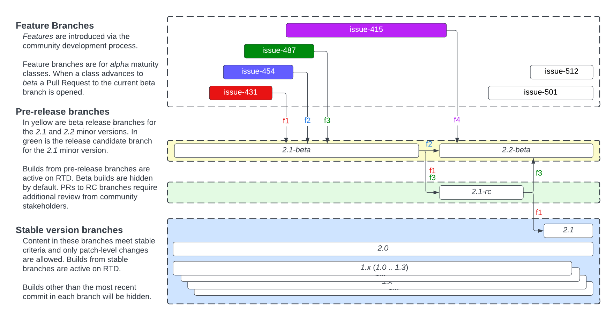

.. _MaturityModelAndVersioning:

Data Class Maturity Model and Versioning
@@@@@@@@@@@@@@@@@@@@@@@@@@@@@@@@@@@@@@@@

The Genomic Knowledge Standards work stream is developing semantic 
data exchange standards for federated genomic knowledge sharing across
multiple inter-related domains of genomic variants, sequence annotations,
study results, and the framework that uses these data to make knowledge
assertions. To address this, new models must be developed
and iterated upon through across GKS community products. This
creates a tension between the need to create stable data models 
while ensuring that models evolve to interoperate smoothly across a 
diverse set of stakeholders. Mechanisms for communicating the stability, 
uptake, and development of data classes are paramount to addressing 
this balance.

A maturity model is a useful mechanism for communicating the stability 
of a developing GKS data class. This is needed to help data producers
at each stage of the adoption lifecycle (Figure 1) decide on the 
appropriate time to engage and implement data classes in their 
development and/or production systems. Data classes that have progressed 
through the maturity model should have an associated progression of 
support from the GKS specification maintainers for message generation, 
translation, and validation tooling. 

The purpose of this document is to define a maturity model for 
communicating the stability and level of commitment supporting GKS 
data classes, with the goal of enabling timely specification 
adoption by the community.

.. figure:: ../images/adoption_lifecycle.png

   **The Innovation Adoption Lifecycle** Adopters in every category along
   the innovation adoption lifecycle benefit from communication about the
   maturity of new data classes generated by the Genomic Knowledge
   Standards work stream. Communicating our outreach strategy should
   consider engagement with these different categories as a primary goal
   of the maturity model, enabling adopters to engage at a time that is
   appropriate for their needs.

.. _MaturityLevels:

Data Class Maturity Levels
##########################

Maturity level criteria

.. figure:: ../images/maturity_levels.png

   Data class maturity level criteria and commitments.

*Maturity advancement process*
Maturity levels are to be reviewed and advanced by consensus among the 
specification leads, in consultation with the associated work group 
membership. Factors to be considered include the criteria specified in 
Data class maturity levels, the degree of adoption observed in the 
community, feedback provided by adopters, and availability of 
specification maintainers to provide the level of support required.

Communicating Maturity Level
############################

*Technical Documentation*
Primary documentation sites (e.g. vrs.ga4gh.org) will include pre-release 
builds (e.g. “2.1.0b3”; see Versioning). The RTD Latest branch will 
point to the most recent release or release candidate.

<Placeholder> a pre-release build on RTD
figure:: images/maturity_levels.png

   Addition of pre-release classes to VRS documentation at vrs.ga4gh.org

   **Legend** An illustration of a pre-release build of VRS available 
   in the version selection tool.

Inclusion of the Release Candidate Classes on the specification page 
provides a mechanism for early adopters (Figure 1) to look at upcoming 
data classes that have already met the bar for interoperable data exchange 
and the associated set of supporting tools for a data class at Release 
Candidate maturity (Table 1).

.. _Versioning:

Versioning
##########

Versions are ascribed to releases of specifications, not to individual data 
classes. It is expected that the maturity of all classes will be at a level 
greater than or equal to the release level (i.e. a beta release MAY include 
beta, rc, and stable maturity classes, but no alpha maturity classes).

Developing features is intrinsically linked to policy surrounding major and 
minor versions, which follow semantic versioning v2 (semver.org) practices 
for API versioning. Version syntax follows PEP 440. A major or minor version 
is considered stable once it is released. A major or minor version may have 
pre-release drafts at the beta and release candidate levels. When referring 
to the current major version, we mean the greatest major version of a 
specification for which there is a stable release. When referring to the 
current minor version, we mean the greatest minor version of a specification 
for which there is a stable release.

*Branch management*

   **Branch management for GKS products.**
   An illustration of the feature development process for GKS
   projects. Features are introduced in Feature Branches, and when they 
   meet the criteria for advancing maturity they are ready for progression 
   into pre-release branches of the corresponding level (i.e. “Beta” 
   [yellow] or “Release Candidate” [green] branches), and ultimately a
   version release branch (blue).
