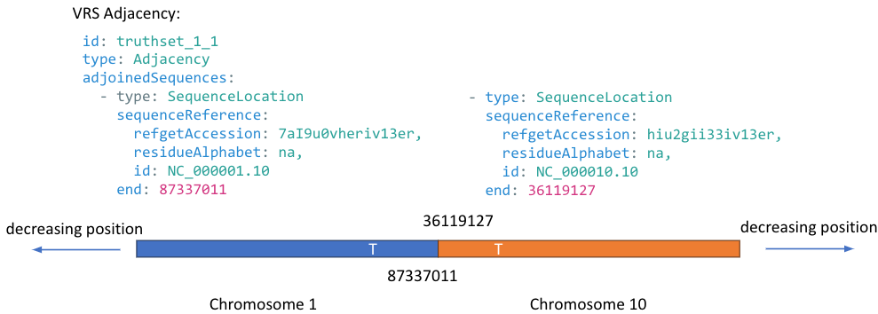

.. _Adjacency:

Adjacency
!!!!!!!!!

.. admonition:: New in v2

   The Adjacency class was added in v2 to describe structural variation.

The adjacency class is a core concept for structural variation, representing the junction point of 
two adjoined molecules. This class can be used on its own (e.g. for junctions of chimeric transcript fusions)
or in higher order structures such as :ref:`DerivativMolecule` to represent molecules derived from multiple
adjacencies (e.g. for translocations).

Definition and Information Model
@@@@@@@@@@@@@@@@@@@@@@@@@@@@@@@@

.. include::  ../../def/vrs/Adjacency.rst

Implementation Guidance
@@@@@@@@@@@@@@@@@@@@@@@

Sequence Locations and Directionality
#####################################

Structural variants on double-stranded nucleic acids may have an adjoined partner that is a reverse complement
of the provided :ref:`SequenceReference`. These types of adjacencies are common in structural variation, and
can be found, for example, on either end of a chromosomal inversion.

To represent this, the :ref:`SequenceLocation` used by each partner of the adjacency is defined using
only one of the `start` or `end` attributes. Defining the location by `start` means that the sequence content 
extends right (increases) on the :ref:`SequenceReference`, and defining the location by `end` means that the
sequence content extends left (decreases) on the :ref:`SequenceReference`.

   **An example simple Adjacency.** The chromosome 1 sequence extends left from position 1:123 and so is defined
   by the location `start`. The chromosome 2 sequence extends right from position 2:456 and so is defined by the
   location `end`.

   **An example Adjacency with a reverse complement partner.** The chromosome 1 sequence extends left from
   position 1:87337011 and so is defined by the location `start`. The chromosome 10 sequence *also* extends left 
   from position 10:36119127 and so is *also* defined by the location `start`. Reading left-to-right along this
   adjacency one would expect reference sequence up to the adjacency and reverse complement sequence following.

Normalization
#############

Conventions for ordering sequences and handling ambiguous sequence Adjacencies are described in 
:ref:`adjacency-normalization`.

Linker Sequences
################

Intervening sequences between adjoined sequences in an adjacency are called *linker sequences* and may be specified 
with a :ref:`SequenceExpression`.`
