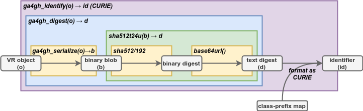

.. _computed-identifiers:

Computed Identifiers
!!!!!!!!!!!!!!!!!!!!

VRS provides an algorithmic solution to deterministically generate a
globally unique identifier from a VRS object itself. All valid
implementations of the VRS Computed Identifier will generate the same
identifier when the objects are identical, and will generate different
identifiers when they are not. The VRS Computed Digest algorithm
obviates centralized registration services, allows computational
pipelines to generate "private" ids efficiently, and makes it easier
for distributed groups to share data.

A VRS Computed Identifier for a VRS concept is computed as follows:

* The object SHOULD be :ref:`normalized <normalization>`.
  Normalization formally applies to all VRS classes.

* Generate binary data to digest. If the object is a :ref:`sequence`
  string, encode it using UTF-8.  Otherwise, serialize the object
  using :ref:`Digest Serialization <digest-serialization>`.

* :ref:`Generate a truncated digest <truncated-digest>` from the binary data.

* :ref:`Construct an identifier <identify>` based on the digest and object type.

.. important:: Normalizing objects is STRONGLY RECOMMENDED for
               interoperability. While normalization is not strictly
               required, automated validation mechanisms are
               anticipated that will likely disqualify Variation that
               is not normalized. See :ref:`should-normalize` for
               a rationale.

The following diagram depicts the operations necessary to generate a
computed identifier.  These operations are described in detail in the
subsequent sections.

.. _ser-dig-id:

   Serialization, Digest, and Computed Identifier Operations

   Entities are shown in gray boxes. Functions are denoted by bold
   italics.  The yellow, green, and blue boxes, corresponding to the
   ``sha512t24u``, ``ga4gh_digest``, and ``ga4gh_identify`` functions
   respectively, depict the dependencies among functions.  ``SHA512``
   is `SHA-512`_ truncated to 24 bytes (192 bits), using the SHA-512
   initialization vector.  base64url_ is the official name of the
   variant of `Base64`_ encoding that uses a URL-safe character
   set. [`figure source
   <https://www.draw.io/?page-id=M8V1EMsVyfZQDDbK8gNL&title=VR%20diagrams.drawio#Uhttps%3A%2F%2Fdrive.google.com%2Fa%2Fharts.net%2Fuc%3Fid%3D1Qimkvi-Fnd1hhuixbd6aU4Se6zr5Nc1h%26export%3Ddownload>`__]

.. note:: Most implementation users will need only the
	  ``ga4gh_identify`` function.  We describe the
	  ``ga4gh_serialize``, ``ga4gh_digest``, and ``sha512t24u``
	  functions here primarily for implementers.

Requirements
@@@@@@@@@@@@

Implementations MUST adhere to the following requirements:

* Implementations MUST use the normalization, serialization, and
  digest mechanisms described in this section when generating GA4GH
  Computed Identifiers.  Implementations MUST NOT use any other
  normalization, serialization, or digest mechanism to generate a
  GA4GH Computed Identifier.

* Implementations MUST ensure that all nested objects are identified
  with GA4GH Computed Identifiers.  Implementations MAY NOT reference
  nested objects using identifiers in any namespace other than
  ``ga4gh``.

.. note:: The GA4GH schema MAY be used with identifiers from any
          namespace. For example, a SequenceLocation may be defined
          using a `sequence_id` = ``refseq:NC_000019.10``.  However,
          an implementation of the Computed Identifier algorithm MUST
          first translate sequence accessions to GA4GH ``SQ``
          accessions to be compliant with this specification.

.. _digest-serialization:

Digest Serialization
@@@@@@@@@@@@@@@@@@@@

Digest serialization converts a VRS object into a binary representation
in preparation for computing a digest of the object.  The Digest
Serialization specification ensures that all implementations serialize
variation objects identically, and therefore that the digests will
also be identical.  |VRS| provides validation tests to ensure
compliance.

.. important:: Do not confuse Digest Serialization with JSON
               serialization or other serialization forms.  Although
               Digest Serialization and JSON serialization appear
               similar, they are NOT interchangeable and will generate
               different GA4GH Digests.

Although several proposals exist for serializing arbitrary data in a
consistent manner ([Gibson]_, [OLPC]_, [JCS]_), none have been
ratified. As a result, |VRS| defines a custom serialization format
that is consistent with these proposals but does not rely on them for
definition; it is hoped that a future ratified standard will be
forward compatible with the process described here.

The first step in serialization is to generate message content.  If
the object is a string representing a :ref:`sequence`, the
serialization is the UTF-8 encoding of the string.  Because this is a
common operation, implementations are strongly encouraged to
precompute GA4GH sequence identifiers as described in
:ref:`required-data`.

If the object is an instance of a VRS class, implementations MUST:

    * ensure that objects are referenced with identifiers in the
      ``ga4gh`` namespace
    * replace each nested :term:`identifiable object` with their
      corresponding *digests*.
    * order arrays of digests and ids by Unicode Character Set values
    * filter out fields that start with underscore (e.g., `_id`)
    * filter out fields with null values

The second step is to JSON serialize the message content with the
following REQUIRED constraints:

    * encode the serialization in UTF-8
    * exclude insignificant whitespace, as defined in `RFC8259§2
      <https://tools.ietf.org/html/rfc8259#section-2>`__
    * order all keys by Unicode Character Set values
    * use two-char escape codes when available, as defined in
      `RFC8259§7 <https://tools.ietf.org/html/rfc8259#section-7>`__

The criteria for the digest serialization method was that it must be
relatively easy and reliable to implement in any common computer
language.

.. _digest-serialization-example:

**Example**

.. code:: ipython3

    allele = models.Allele(location=models.SequenceLocation(
        sequence_id="ga4gh:SQ.IIB53T8CNeJJdUqzn9V_JnRtQadwWCbl",
        interval=simple_interval),
        state=models.SequenceState(sequence="T"))
    ga4gh_serialize(allele)

Gives the following *binary* (UTF-8 encoded) data:

.. parsed-literal::

    {"location":"u5fspwVbQ79QkX6GHLF8tXPCAXFJqRPx","state":{"sequence":"T","type":"SequenceState"},"type":"Allele"}

For comparison, here is one of many possible JSON serializations of the same object:

.. code:: ipython3

    allele.for_json()

.. parsed-literal::

    {
      "location": {
        "interval": {
          "end": 44908822,
          "start": 44908821,
          "type": "SimpleInterval"
        },
        "sequence_id": "ga4gh:SQ.IIB53T8CNeJJdUqzn9V_JnRtQadwWCbl",
        "type": "SequenceLocation"
      },
      "state": {
        "sequence": "T",
        "type": "SequenceState"
      },
      "type": "Allele"
    }

.. _truncated-digest:

Truncated Digest (sha512t24u)
@@@@@@@@@@@@@@@@@@@@@@@@@@@@@

The sha512t24u truncated digest algorithm [Hart2020]_ computes an ASCII digest
from binary data.  The method uses two well-established standard
algorithms, the `SHA-512`_ hash function, which generates a binary
digest from binary data, and a URL-safe variant of `Base64`_ encoding, which encodes
binary data using printable characters.

Computing the sha512t24u truncated digest for binary data consists of
three steps:

1. Compute the `SHA-512`_ digest of a binary data.
2. Truncate the digest to the left-most 24 bytes (192 bits).  See
   :ref:`truncated-digest-collision-analysis` for the rationale for 24
   bytes.
3. Encode the truncated digest as a base64url_ ASCII string.

.. code-block:: python

   >>> import base64, hashlib
   >>> def sha512t24u(blob):
           digest = hashlib.sha512(blob).digest()
           tdigest = digest[:24]
           tdigest_b64u = base64.urlsafe_b64encode(tdigest).decode("ASCII")
           return tdigest_b64u
   >>> sha512t24u(b"ACGT")
   'aKF498dAxcJAqme6QYQ7EZ07-fiw8Kw2'

.. _identify:

Identifier Construction
@@@@@@@@@@@@@@@@@@@@@@@

The final step of generating a computed identifier for a VRS object is
to generate a `W3C CURIE <https://www.w3.org/TR/curie/>`__ formatted identifier, which
has the form::

    prefix ":" reference

The GA4GH VRS constructs computed identifiers as follows::

    "ga4gh" ":" type_prefix "." <digest>

.. warning:: Do not confuse the W3C CURIE ``prefix`` ("ga4gh") with the
          type prefix.

Type prefixes used by VRS are:

.. _type_prefixes:
.. csv-table::
   :header: type_prefix, VRS class name
   :align: left

   SQ, Sequence
   VA, Allele
   VH, Haplotype
   VAB, Abundance
   VS, VariationSet
   VSL, SequenceLocation
   VCL, ChromosomeLocation
   VT, Text

For example, the identifer for the allele example under :ref:`digest-serialization` gives:

.. parsed-literal::

   ga4gh\:VA.EgHPXXhULTwoP4-ACfs-YCXaeUQJBjH\_

References
@@@@@@@@@@

.. [Hart2020] Hart RK, Prlić A. **SeqRepo: A system for managing local
			  collections of biological sequences.** PLoS
			  One. 2020;15:
			  e0239883. `doi:10.1371/journal.pone.0239883
			  <https://journals.plos.org/plosone/article/comments?id=10.1371/journal.pone.0239883>`__
.. [Gibson] `Gibson Canonical JSON <http://gibson042.github.io/canonicaljson-spec/>`__
.. [OLPC] `OLPC Canonical JSON <http://wiki.laptop.org/go/Canonical_JSON>`__
.. [JCS] `JSON Canonicalization Scheme <https://tools.ietf.org/html/draft-rundgren-json-canonicalization-scheme-05>`__
