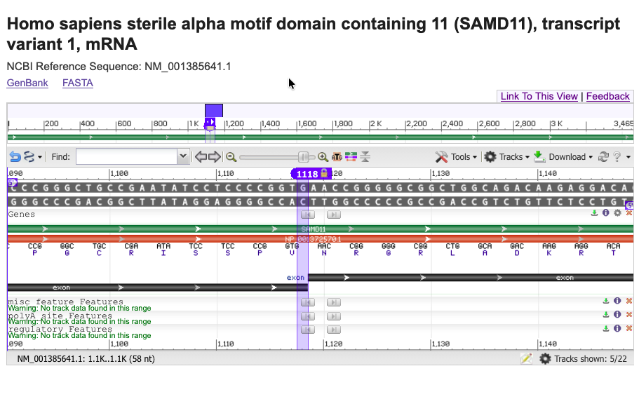
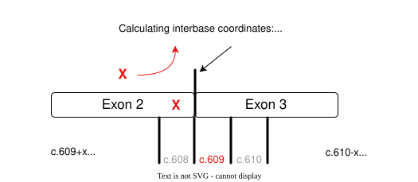
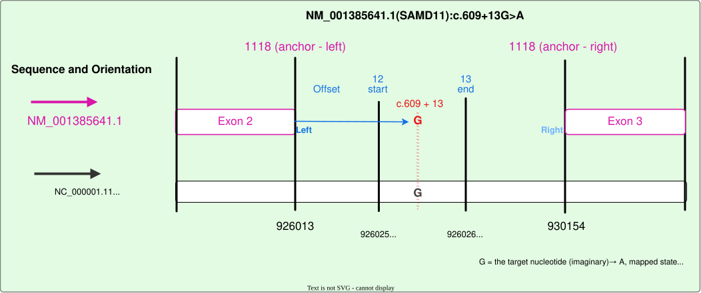
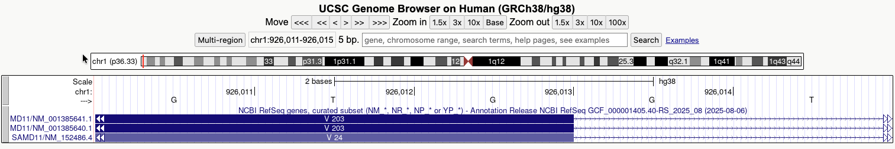
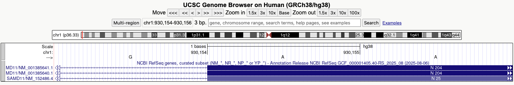

Splice donor — downstream intronic variant
==========================================

This example demonstrates how a splice-adjacent intronic HGVS variant is represented using ``RelativeAllele``. The variant occurs immediately downstream of a splice donor site and is expressed using HGVS c. notation.

HGVS expression
---------------

We will use the following HGVS expression from ClinVar: `NM_001385641.1(SAMD11):c.609+13G>A <https://www.ncbi.nlm.nih.gov/clinvar/variation/2089674/>`_.

This expression specifies a single-nucleotide variant located downstream of the coding exon boundary, placing the variant in the intron adjacent to a splice donor site.

Transcript context
------------------

`NCBI Reference Sequence: NM_001034954.3 <https://www.ncbi.nlm.nih.gov/nuccore/NM_001385641>`_

* Positive strand
* Splice donor (exon → intron boundary)
* Downstream intronic (intron side of the exon boundary)

Transcript features at the splice junction
------------------------------------------

The exon boundaries below provide the local transcript context used to interpret the splice-adjacent HGVS position and to identify the exon boundary referenced by the HGVS expression.

.. code-block::

  CDS            510..3044
  exon 2         1027..1118
                      /gene="SAMD11"
  exon 3         1119..1300
                      /gene="SAMD11"

NCBI graphical sequence view
----------------------------

The figure below shows the same region in the NCBI Sequence Viewer, which displays transcript structure and exon boundaries aligned to the reference sequence.

es,id:STD3760889287,subkey:misc_feature,annots:Unnamed,shown:true,order:21][key:feature_track,name:Other features---polyA_site,display_name:polyA_site Features,id:STD3911386278,subkey:polyA_site,annots:Unnamed,shown:true,order:22][key:feature_track,name:Other features---regulatory,display_name:regulatory Features,id:STD2883984253,subkey:regulatory,annots:Unnamed,shown:true,order:23]&mk=1118|1118|blue|9&v=1096:1139&c=33CCCC&select=null&slim=0

  NCBI Sequence Viewer showing the splice donor region in NM_001385641.1

Anchor selection
----------------

To represent this variant, an anchor is chosen at the inter-residue position corresponding to the exon boundary referenced by the HGVS expression. For splice-donor variants, this anchor is placed at the end of the exon preceding the intron.

Anchor selection is determined by splice context and does not depend on transcript orientation. In this example, the exon end occurs at inter-residue position **1118**, which is used as the anchor.

The diagram below illustrates the selected anchor position relative to the exon boundary.

Mapping relative to the anchor
------------------------------

Offsets are applied relative to the anchor to identify the transcript-relative inter-residue interval corresponding to the HGVS position.

Because the anchor corresponds to an exon junction, ``anchorOrientation`` is used to select which side of the anchor is used as the reference point. For this splice-donor variant, the anchor is oriented to the **left**, selecting the side of the anchor immediately preceding the exon boundary.

Offsets are expressed in inter-residue coordinates. In this example, ``offsetStart = 12`` and ``offsetEnd = 13`` select the single inter-residue interval downstream of the exon boundary, corresponding to the nucleotide referenced by the HGVS expression.

Transcript orientation is then used to map this inter-residue interval to the genomic reference.

In this example, the variant is described relative to the transcript reference sequence (``NM_001385641.1``), where the reference base at the variant position is ``G``.

The variant state is therefore shown on the transcript as the **mapped state** (``G → A``), and on the corresponding genomic reference (``NC_000011.10``) as the **base state** (``G → A``). Because this transcript is on the positive strand, the mapped and base states are identical.

The diagram below illustrates the application of offsets relative to the anchor, the resolved inter-residue interval, and the relationship between the mapped and base states.

The corresponding exon boundaries on the genomic reference are shown below for visual confirmation.

  Exon 2 boundary in the UCSC Genome Browser.

  Exon 3 boundary in the UCSC Genome Browser.

Relative Allele representation
------------------------------

Together, the anchor position and offsets resolve the location of the variant, which can then be represented as a VRS ``RelativeAllele``. The resulting object captures the transcript-relative mapping, the resolved genomic location, and the allele state expressed on both sequences.

.. code-block:: json

    {
      "type": "RelativeAllele",
      "relativeLocation": {
        "baseSequenceLocation": {
          "type": "SequenceLocation",
          "sequenceReference": {
            "type": "SequenceReference",
            "id": "NC_000011.10",
            "refgetAccession": "SQ.2NkFm8HK88MqeNkCgj78KidCAXgnsfV1"
          },
          "start": 926025,
          "end": 926026
        },
        "mappedSequenceLocation": {
          "sequenceReference": {
            "type": "SequenceReference",
            "id": "NM_001385641.1",
            "refgetAccession": "SQ.cXRaN1IhgR6Mg9U-qafH2Be6IuQgB6Ox"
          },
          "anchor": 1118,
          "anchorOrientation": "left",
          "offsetStart": 12,
          "offsetEnd": 13
        }
      },
      "mappedState": {
        "type": "LiteralSequenceExpression",
        "sequence": "A"
      },
      "baseState": {
        "type": "LiteralSequenceExpression",
        "sequence": "A"
      }
    }
