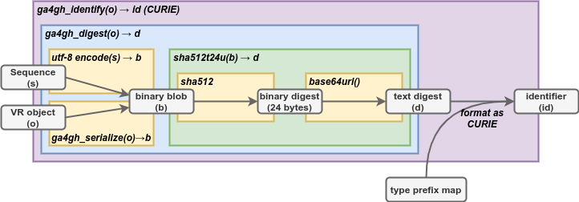

.. _computed-identifiers:

Computed Identifiers
!!!!!!!!!!!!!!!!!!!!

.. note:: This section depends on the :ref:`ga4gh-identifiers`, which
          is submitted concurrently.  Based on conversations with
          GA4GH technical leaders, we expect that the proposal will be
          approved and have therefore assumed acceptance when writing
          this section.  In the event that the proposal is not
          accepted, this section will be modified as described in
          :ref:`plan-b`.  Because identifiers created
          through this proposal are expected to be durable, it is
          critical for GA4GH to make a long-term decision regarding
          identifiers.

The VR-Spec provides an algorithmic solution to deterministically
generate a globally unique identifier from a VR object itself. All
valid implementations of the VR Computed Identifier will generate the
same identifier when the objects are identical, and will generate
different identifiers when they are not. The VR Computed Digest
algorithm obviates centralized registration services, allows
computational pipelines to generate "private" ids efficiently, and
makes it easier for distributed groups to share data.

A VR Computed Identifier for a VR concept is computed as follows:

* if the object is a :ref:`sequence`, encode using UTF-8
* if the object is an :ref:`allele`, :ref:`normalize <normalization>` it
* :ref:`Serialize the object <serialization>` into binary data.
* :ref:`Generate a truncated digest <truncated-digest>` from the binary data.
* :ref:`Construct an identifier <identify>` based on the digest and object type.

The following diagram depicts the operations necessary to generate a
computed identifier.  These operations are described in detail in the
subsequent sections.

.. _ser-dig-id:

   **Serialization, Digest, and Computed Identifier Operations**
   Entities are shown in gray boxes. Functions are denoted by bold
   italics.  The yellow, green, and blue boxes, corresponding to the
   ``sha512t24u``, ``ga4gh_digest``, and ``ga4gh_identify`` functions
   respectively, depict the dependencies among functions.
   ``SHA512/192`` is `SHA-512`_ truncated at 192 bits using the
   systematic name recommended by SHA-512 (§5.3.6).  base64url_ is the
   official name of the variant of `Base64`_ encoding that uses a
   URL-safe character set. [`figure source
   <https://www.draw.io/?page-id=M8V1EMsVyfZQDDbK8gNL&title=VR%20diagrams.drawio#Uhttps%3A%2F%2Fdrive.google.com%2Fa%2Fharts.net%2Fuc%3Fid%3D1Qimkvi-Fnd1hhuixbd6aU4Se6zr5Nc1h%26export%3Ddownload>`__]

Requirements
@@@@@@@@@@@@

Implementations MUST adhere to the following requirements:

* The VR Computed Identifier algorithm applies only to *identifiable*
  objects, that is, objects with an `id` property.

* The VR Computed Identifier is NOT defined if used with any other
  normalization, serialization, or digest mechanism to generate a
  GA4GH Computed Identifier.

* VR Computed Identifiers are defined only when all nested objects are
  identified with ``ga4gh`` identifiers.  Generating VR identifiers
  using objects referenced within any other namespace is not compliant
  with this specification. In particular, it is not compliant to
  generate VR identifiers using sequences referenced with RefSeq,
  Ensembl, or other accession outside the `ga4gh`` namespace.

.. _serialization:

VR Serialization
@@@@@@@@@@@@@@@@

.. important:: Do not confuse VR serialization with other
   serialization formats, including JSON serialization used to
   transmit VR messages.  Although VR and JSON serializations appear
   similar, they are NOT interchangeable. A VR object might have many
   valid JSON serializations, but it will have only one valid VR
   serialization.

VR serialization converts a VR object into a binary representation in
preparation for computing a digest of the object.  The VR
serialization specification ensures that all implementations serialize
variation objects identically, and therefore that the digests will
also be identical.  |vr-spec| provides validation tests to ensure
compliance.

Although several proposals exist for serializing arbitrary data in a
consistent manner ([Gibson]_, [OLPC]_, [JCS]_), none have been
ratified. As a result, |vr-spec| defines a custom serialization format
that is consistent with these proposals but does not rely on them for
definition; it is hoped that a future ratified standard will be
forward compatible with the process described here.

The first step in serialization is to generate message content.  If
the object is a string representing a :ref:`sequence`, the
serialization is the UTF-8 encoding of the string.  Because this is a
common operation, implementations are strongly encouraged to
precompute GA4GH sequence identifiers as described in
:ref:`required-data`.

If the object is a composite VR object, implementations MUST:

    * ensure that objects are referenced with identifiers in the
      ``ga4gh`` namespace
    * replace nested identifiable objects (i.e., objects that have id
      properties) with their corresponding *digests*
    * order arrays of digests and ids by Unicode Character Set values
    * filter out id fields
    * filter out fields with null values

The second step is to JSON serialize the message content with the
following REQUIRED constraints:

    * encode the serialization in UTF-8
    * exclude insignificant whitespace, as defined in `RFC8259§2
      <https://tools.ietf.org/html/rfc8259#section-2>`__
    * order all keys by Unicode Character Set values
    * use two-char escape codes when available, as defined in
      `RFC8259§7 <https://tools.ietf.org/html/rfc8259#section-7>`__

The criteria for the VR serialization method was that it must be
relatively easy and reliable to implement in any common computer
language.

.. _truncated-digest:

Truncated Digest (sha512t24u)
@@@@@@@@@@@@@@@@@@@@@@@@@@@@@

The Truncated Digest algorithm computes an ASCII digest from binary
data.  The method uses two well-established standard algorithms, the
`SHA-512`_ hash function, which generates a binary digest from binary
data, and `Base64`_ URL encoding, which encodes binary data using
printable characters.  Computing the Truncated Digest for binary data
consists of three steps:

1. Compute the `SHA-512`_ digest of a binary data.
2. Truncate the digest to the left-most 24 bytes (192 bits).  See
   :ref:`truncated-digest-collision-analysis` for the rationale for 24
   bytes.
3. Encode the truncated digest as a base64url_ ASCII string.

.. code-block:: python

   >>> import base64, hashlib
   >>> def truncated_digest(blob): 
           digest = hashlib.sha512(blob).digest() 
           tdigest = digest[:24] 
           tdigest_b64u = base64.urlsafe_b64encode(tdigest).decode("ASCII") 
           return tdigest_b64u 
   >>> truncated_digest(b"ACGT")
   'aKF498dAxcJAqme6QYQ7EZ07-fiw8Kw2'

.. _identify:

Identifier Construction
@@@@@@@@@@@@@@@@@@@@@@@

The final step of generating a computed identifier for a VR object is
to generate a `W3C CURIE <curie-spec>`_ formatted identifier, which
has the form::

    prefix ":" reference

The GA4GH VR Spec constructs computed identifiers as follows::

    "ga4gh" ":" type_prefix "." <digest>

.. note:: Do not confuse the W3C CURIE ``prefix`` ("ga4gh") with the
          type prefix.

Type prefixes used by VR are:

.. _type_prefixes:
.. csv-table::
   :header: type_prefix, VR Spec class name
   :align: left

   SQ, Sequence
   VA, Allele
   VSL, Sequence Location
   VT, Text
   (reserved), 
   VCL, Cytoband Location
   VGL, Gene Location
   VH, Haplotype
   VG, Genotype
   VX, Translocation

For example::

    ga4gh:SQ.v_QTc1p-MUYdgrRv4LMT6ByXIOsdw3C_

.. todo:: update code to reflect these suffixes. See
          https://github.com/ga4gh/vr-python/issues/31

.. _plan-b:
   
Namespace Contingency Plan
@@@@@@@@@@@@@@@@@@@@@@@@@@

In the event that :ref:`ga4gh-identifiers` is not accepted, the
following changes will be made to this section of the specification:

* The namespace (CURIE prefix) will become ``ga4gh.vr``.

* In the function names `ga4gh_digest`, `ga4gh_identify`, and
  `ga4gh_serialize`, `ga4gh` will be replaced with `vr`.

* The GA4GH VR team will manage type prefixes.

All other aspects of the computed identifier scheme will remain intact.

----

**References**

.. [Gibson] `Gibson Canonical JSON <http://gibson042.github.io/canonicaljson-spec/>`__
.. [OLPC] `OLPC Canonical JSON <http://wiki.laptop.org/go/Canonical_JSON>`__
.. [JCS] `JSON Canonicalization Scheme <https://tools.ietf.org/html/draft-rundgren-json-canonicalization-scheme-05>`__

