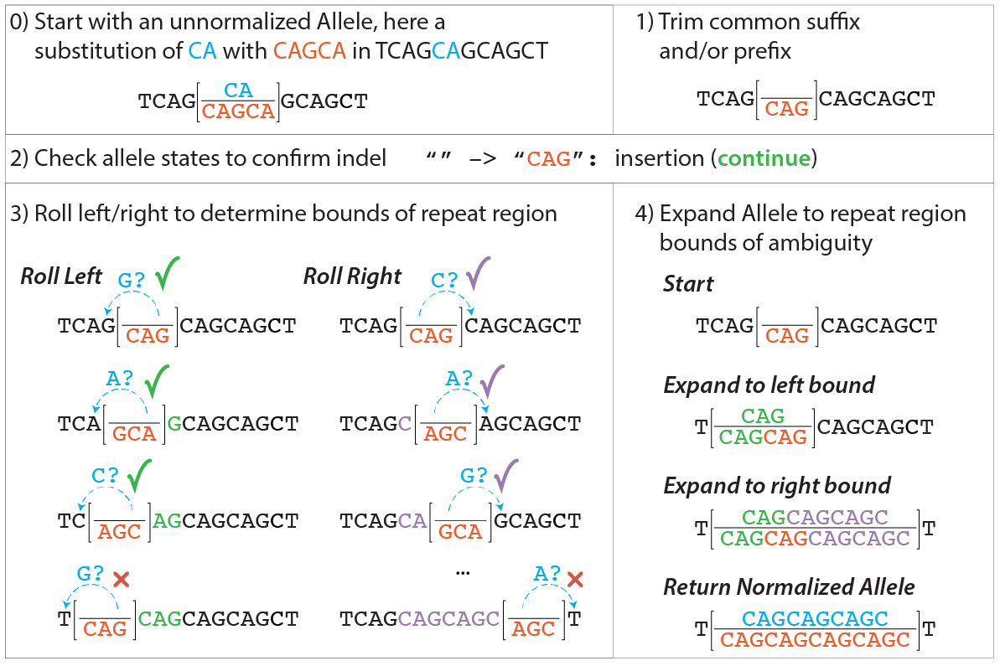

.. _normalization:

Normalization
!!!!!!!!!!!!!

In VRS, "normalization" refers to the process of rewriting an
ambiguous variation representation of variation into a canonical form.
Normalization eliminates a class of ambiguity that impedes comparison
of variation across systems.

In the sequencing community, "normalization" refers to the process of
converting a given sequence variant into a canonical form, typically
by left- or right-shuffling insertion/deletion variants.  VRS
normalization extends this concept to all classes of VRS Variation
objects.

Implementations MUST provide a normalize function that accepts *any*
Variation object and returns a normalized Variation.  Guidelines for
these functions are below.

General Normalization Rules
@@@@@@@@@@@@@@@@@@@@@@@@@@@

* Object types that do not have explicit VRS normalization rules below
  are returned as-is.  That is, all types of Variation MUST be
  supported, even if such objects are unchanged.
* VRS normalization functions are idempotent: Normalizing a
  previously-normalized object returns an equivalent object.
* VRS normalization functions are not necessarily homomorphic: That
  is, the input and output objects may be of different types.

Allele Normalization
@@@@@@@@@@@@@@@@@@@@

Certain insertion or deletion alleles may have ambiguous
representations when using conventional sequence normalization,
resulting in significant challenges when comparing such alleles.

VRS uses a "fully-justified" normalization algorithm adapted from
NCBI's Variant Overprecision Correction Algorithm [1]_.
Fully-justified normalization expands such ambiguous representation
over the entire region of ambiguity, resulting in an *unambiguous*
representation that may be readily compared with other alleles.

This algorithm was designed for :ref:`Allele` instances in which the
Reference Allele Sequence and Alternate Allele Sequence are
precisely known and intended to be normalized. In some instances,
this may not be desired, e.g. faithfully maintaining a sequence
represented as a repeating subsequence through a RepeatSequenceExpression
object. We also anticipate that these edge cases will not be common,
and encourage adopters to use the VRS Allele Normalization Algorithm
whenever possible.

LiteralSequenceExpression Alleles
#################################

When normalizing an Allele with a `LiteralSequenceExpression` state,
the following normalization rules apply:

0. Start with an unnormalized Allele, with corresponding `reference`
   and `alternate` Allele Sequences.

   a. The `Reference Allele Sequence` refers to the subsequence at the
      Allele SequenceLocation.

   #. The `Alternate Allele Sequence` refers to the Sequence described
      by the Allele `state` attribute.

   #. Let `start` and `end` initially be the start and end of the Allele
      SequenceLocation.

#. Trim common flanking sequence from Allele sequences.

   a. Trim common suffix sequence (if any) from both of the Allele
      Sequences and decrement `end` by the length of the trimmed suffix.

   #. Trim common prefix sequence (if any) from both of the Allele
      Sequences and increment `start` by the length of the trimmed prefix.

#. Compare the two Allele sequences, if:

   a. both are empty, the input Allele is a reference Allele. Return the
      input Allele unmodified.

   #. both are non-empty, the input Allele has been normalized to a
      substitution. Return a new Allele with the modified `start`, `end`,
      and `Alternate Allele Sequence`.

   #. one is empty, the input Allele is an insertion (empty `reference
      sequence`) or a deletion (empty `alternate sequence`). Continue to
      step 3.

#. Determine bounds of ambiguity.

   a. Left roll: Set a `left_roll_bound` equal to `start`. While the terminal
      base of the non-empty Allele sequence is equal to the base preceding
      the `left_roll_bound`, decrement `left_roll_bound` and circularly
      permute the Allele sequence by removing the last character of the
      Allele sequence, then prepending the character to the resulting Allele
      sequence.

   #. Right roll: Set a `right_roll_bound` equal to `start`. While the terminal
      base of the non-empty Allele sequence is equal to the base following
      the `right_roll_bound`, increment `right_roll_bound` and circularly permute
      the Allele sequence by removing the first character of the Allele
      sequence, then appending the character to the resulting Allele sequence.

#. Construct a new Allele covering the entire region of ambiguity.

   a. Prepend characters from `left_roll_bound` to `start` to both
      Allele Sequences.

   #. Append characters from `start` to `right_roll_bound` to both
      Allele Sequences.

   #. Set `start` to `left_roll_bound` and `end` to `right_roll_bound`,
      and return a new Allele with the modified `start`, `end`, and
      `Alternate Allele Sequence`.

.. _normalization-diagram:

    A demonstration of fully justifying an insertion allele.

    Reproduced from [2]_

RepeatedSequenceExpression Alleles
##################################

When normalizing an Allele with a :ref:`RepeatedSequenceExpression` state,
normalization is similar to that of :ref:`LiteralSequenceExpression`, expanding
the `Reference Allele Sequence` to capture the entire region of ambiguity.
Unlike :ref:`LiteralSequenceExpression` normalization, however, the region of
ambiguity is defined by full-length repeat subunits. The `Alternate Allele Sequence`
is also expanded in this way, but is represented by altering the
`RepeatedSequenceExpression.count` attribute, rather than the `seq_expr` attribute.

The above only applies if `RepeatedSequenceExpression.seq_expr` is set to a
:ref:`LiteralSequenceExpression` object. If the `RepeatedSequenceExpression.seq_expr`
is instead a `DerivedSequenceExpression`, the `Allele` SHOULD be returned as-is.

.. todo: Illustrate this process.

**References**

.. [1] Holmes JB, Moyer E, Phan L, Maglott D, Kattman B.
	   **SPDI: Data Model for Variants and Applications at NCBI.
	   Bioinformatics.** 2019. `doi:10.1093/bioinformatics/btz856`_
	   
.. [2] Wagner AH, Babb L, Alterovitz G, Baudis M, Brush M, Cameron DL,
	   ..., Hart RK. **The GA4GH Variation Representation Specification (VRS):
	   a Computational Framework for the Precise Representation and
	   Federated Identification of Molecular Variation.**
	   bioRxiv. 2021. `doi:10.1101/2021.01.15.426843`_

.. _doi:10.1101/2021.01.15.426843: https://doi.org/10.1101/2021.01.15.426843
.. _doi:10.1093/bioinformatics/btz856: https://doi.org/10.1093/bioinformatics/btz856
