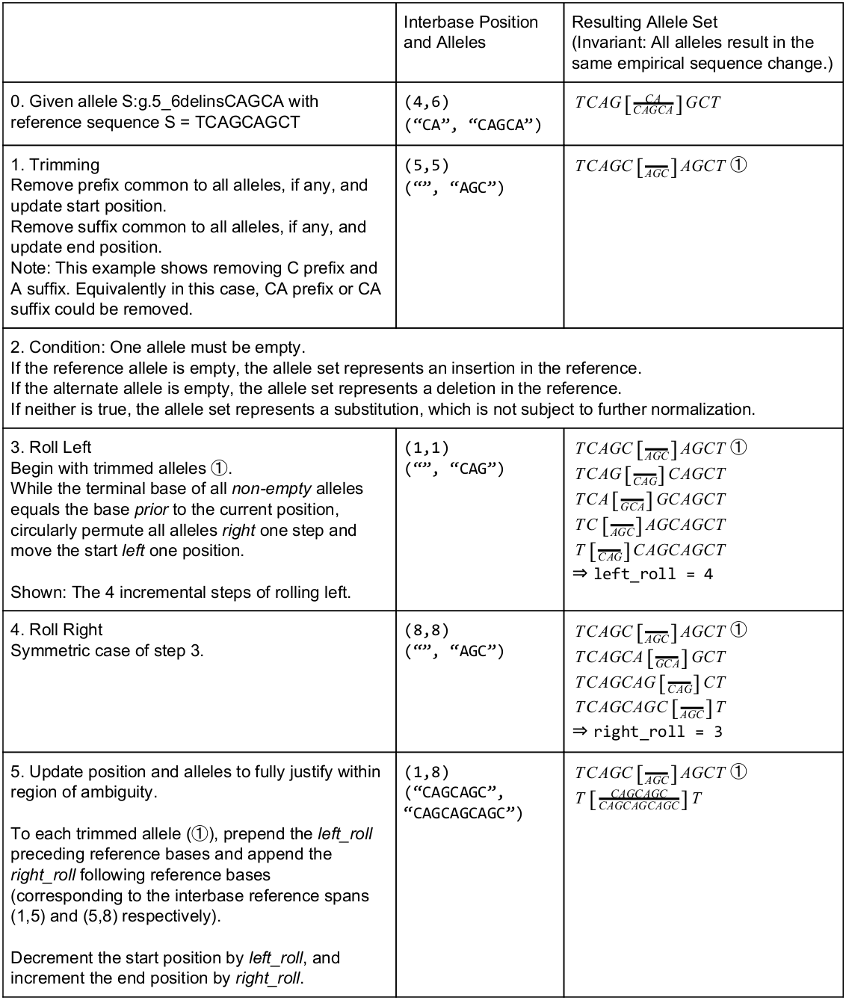

.. _normalization:

Normalization
!!!!!!!!!!!!!

Certain insertion or deletion alleles may be represented ambiguously
when using conventional sequence normalization, resulting in
significant challenges when comparing such alleles.

The VR-Spec describes a "fully-justified" normalization algorithm
inspired by NCBI's Variant Overprecision Correction Algorithm [1]_.
Fully-justified normalization expands such ambiguous representation
over the entire region of ambiguity, resulting in an *unambiguous*
representation that may be readily compared with other alleles.

The VR-Spec RECOMMENDS that Alleles at precise locations are
normalized to a fully justified form unless there is a compelling
reason to do otherwise.

The process for fully justifying two alleles (reference sequence and
alternate sequence) at an interval is outlined below.

1. Trim sequences:

   * Remove suffixes common to all alleles, if any. Decrement
     the interval end position by the length of the trimmed suffix.
   * Remove prefixes common to all alleles, if any. Increment
     the interval start position by the length of the trimmed prefix.
   * If neither allele is empty, the allele pairs represent a alleles
     that do not have common prefixes or suffixes.  Normalization is not
     applicable and the trimmed alleles are returned.

2. Determine bounds of ambiguity:

   * Left roll: While the terminal base of all non-empty alleles is
     equal to the base *prior* to the current position, circularly
     permute all alleles *rightward* and move the current position
     *leftward*. When the terminating, return `left_roll`, the number
     of steps rolled leftward.
   * Right roll: Symmetric case of left roll, returning `right_roll`,
     the number of steps rolled rightward.

3. Update position and alleles: 

   * To each trimmed allele, prepend the `left_roll` bases prior to the
     trimmed allele position and append the `right_roll` bases after
     the trimmed allele position.
   * Expand the trimmed allele position by decrementing the start by
     `left_roll` and incrementing the end by `right_roll`.

.. _normalization-diagram:

   **VR Justified Normalization**

   Demonstration of fully justifying an insertion allele.

**References**

.. [1] Holmes, J. B., Moyer, E., Phan, L., Maglott, D. &
       Kattman, B. L. *SPDI: Data Model for Variants and Applications
       at NCBI.* bioRxiv 537449 (2019). `doi:10.1101/537449`_

.. _doi:10.1101/537449: https://doi.org/10.1101/537449
