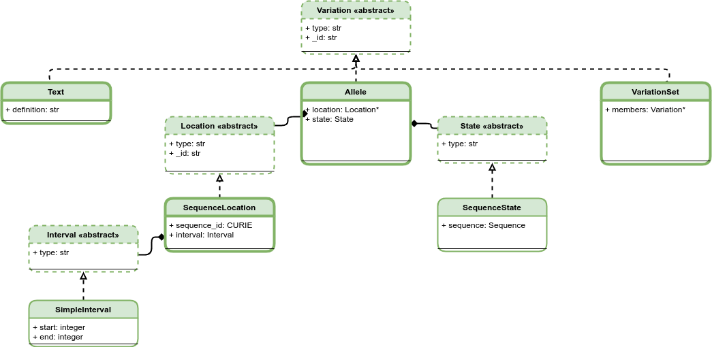

Schema
!!!!!!

Overview
@@@@@@@@

.. _vr-schema-diagram:

   Current Variation Representation Specification Schema

   **Legend** The VRS information model consists of several interdependent
   data classes, including both concrete classes and abstract superclasses
   (indicated by <<abst>> stereotype in header). These classes may be broadly
   categorized as conceptual representations of Variation (green boxes),
   Feature (blue boxes), Location (light blue boxes), SequenceExpression
   (purple boxes), and General Purpose Types (gray boxes). The general purpose
   types support the primary classes, including intervals, ranges, Number and
   GA4GH Sequence strings (not shown). While all VRS objects are Value
   Objects, only some objects are intended to be identifiable (Variation,
   Location, and Sequence). Conceptual inheritance relationships between
   classes is indicated by connecting lines.  [`source
   <https://app.diagrams.net/#G1Qimkvi-Fnd1hhuixbd6aU4Se6zr5Nc1h>`__]

Machine Readable Specifications
@@@@@@@@@@@@@@@@@@@@@@@@@@@@@@@

The machine readable VRS is written using `JSON Schema
<https://json-schema.org/>`_.

The schema itself is written in YAML (|vrs_yaml|) and converted to JSON
(|vrs_json|).

Contributions to the schema MUST be written in the YAML document.
 

.. |vrs_json| replace:: :download:`vrs.json <_static/vrs.json>`
.. |vrs_yaml| replace:: :download:`vrs.yaml <_static/vrs.yaml>`
