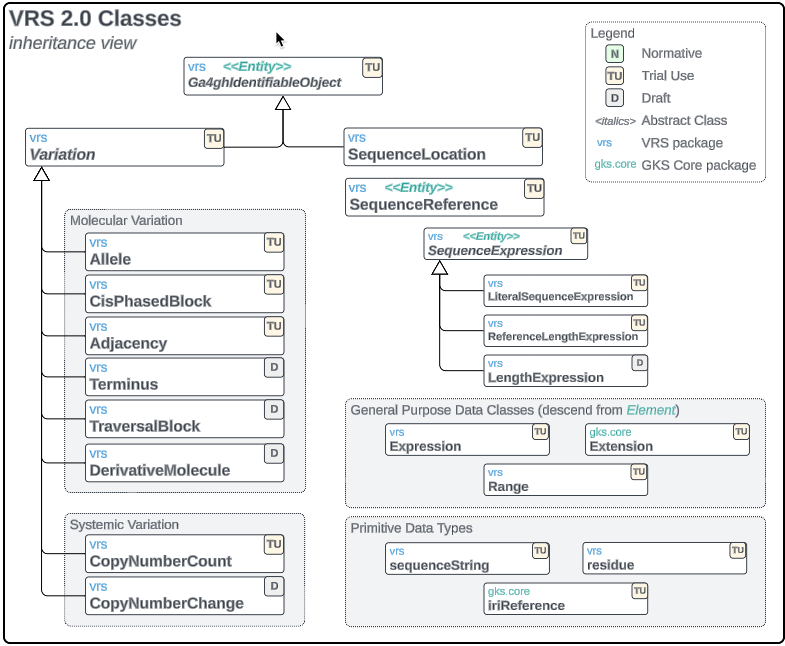

Schema
!!!!!!

Overview
@@@@@@@@

.. _vr-schema-diagram:

   Current Variation Representation Specification Schema

Machine Readable Specifications
@@@@@@@@@@@@@@@@@@@@@@@@@@@@@@@

The machine readable VRS is written using `JSON Schema
<https://json-schema.org/>`_.

The schema itself is written in YAML (|vrs_yaml|) and converted to JSON
(|vrs_json|).

Contributions to the schema MUST be written in the YAML document.

.. |vrs_json| replace:: :download:`vrs.json <_static/vrs.json>`
.. |vrs_yaml| replace:: :download:`vrs.yaml <_static/vrs.yaml>`
