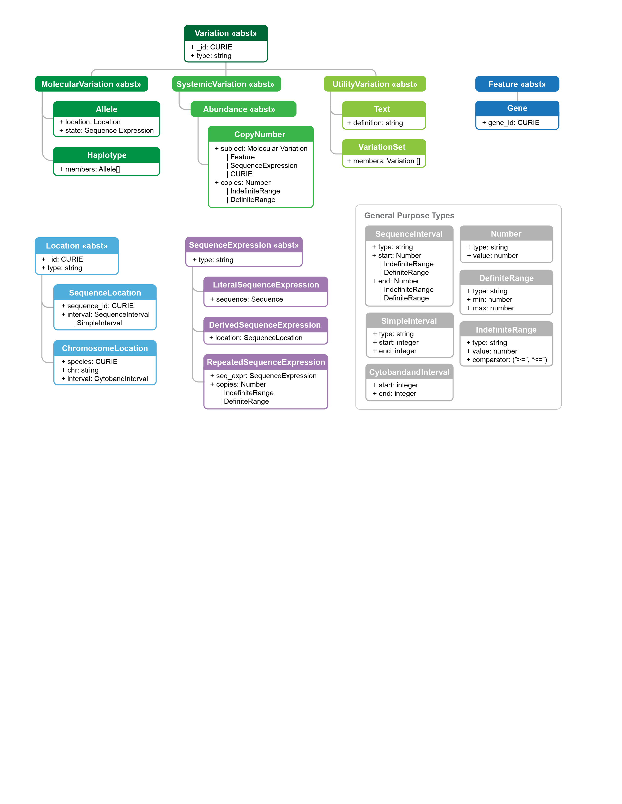

Schema
!!!!!!

.. todo::
   The below figure will be updated prior to v1.2 release.

Overview
@@@@@@@@

.. _vr-schema-diagram:

   Current Variation Representation Specfication Schema

   **Legend** Classes (data types) are shown as boxes.  Abstract
   classes are denoted by dotted outline; "identifiable" classes,
   which may be referenced with an identifier, are denoted by bold
   borders; non-identifiable classes are denoted by thin solid
   borders.  Inheritance and composition are shown with dotted gray
   and solid black lines connecting classes, respectively.  All
   classes have a string `type`.  Abstract classes enable
   specializations of concepts in this and future versions of VRS.
   Identifiable classes have an optional `_id`
   attribute. Non-identifiable classes exist only to structure data
   always occur "inline" within objects.  Inherited attributes are not
   shown in this diagram.  An asterisk (*) denotes a nullable
   attribute. A dagger (†) denotes attributes that may be specified
   with inline objects or references to the same type.

   [`source
   <https://app.diagrams.net/#G1Qimkvi-Fnd1hhuixbd6aU4Se6zr5Nc1h>`__]

Machine Readable Specifications
@@@@@@@@@@@@@@@@@@@@@@@@@@@@@@@

The machine readable VRS is written using `JSON Schema
<https://json-schema.org/>`_.

The schema itself is written in YAML (|vrs_yaml|) and converted to JSON
(|vrs_json|).

Contributions to the schema MUST be written in the YAML document.
 

.. |vrs_json| replace:: :download:`vrs.json <_static/vrs.json>`
.. |vrs_yaml| replace:: :download:`vrs.yaml <_static/vrs.yaml>`
