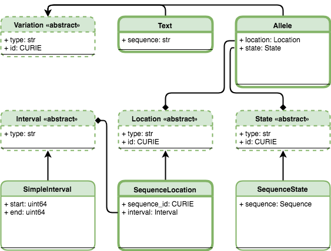

Teminology & Information Model
!!!!!!!!!!!!!!!!!!!!!!!!!!!!!!

When biologists define terms in order to describe phenomena and
observations, they rely on a background of human experience and
intelligence for interpretation. Definitions may be abstract, perhaps
correctly reflecting uncertainty of our understanding at the
time. Unfortunately, such terms are not readily translatable into an
unambiguous representation of knowledge.

For example, "allele" might refer to "an alternative form of a gene or
locus" [`Wikipedia`_], "one of two or more forms of the DNA sequence
of a particular gene" [`ISOGG`_], or "one of a set of coexisting
sequence alleles of a gene" [`Sequence Ontology`_]. Even for human
interpretation, these definitions are inconsistent: does the
definition describe a precise sequence change or a qualitative one? In
addition, all three definitions are inconsistent with the practical
need for a way to describe sequence changes outside regions associated
with genes.

**The computational representation of biological concepts requires
translating precise biological definitions into data structures that
can be used by implementers.** This translation should result in a
representation of information that is consistent with conventional
biological understanding and, ideally, be able to accommodate future
data as well. The resulting *computational representation* of
information should also be cognizant of computational performance, the
minimization of opportunities for misunderstanding, and ease of
manipulating and transforming data.

Accordingly, for each term we define below, we begin by describing the
term as used by biologists (**biological definition**) as
available. When a term has multiple biological definitions, we
explicitly choose one of them for the purposes of this
specification. We then provide a computer modeling definition
(**computational definition**) that reformulates the biological
definition in terms of information content. We then translate each of
these computational definitions into precise specifications for
representing information (**logical model**). Terms are ordered
"bottom-up" so that definitions depend only on previously-defined
terms.

.. note:: The keywords "MUST", "MUST NOT", "REQUIRED", "SHALL", "SHALL NOT", "SHOULD", "SHOULD NOT",
          "RECOMMENDED", "MAY", and "OPTIONAL" in this document are to be interpreted as described
          in `RFC 2119`_.

Primitive Concepts
@@@@@@@@@@@@@@@@@@

.. _id:

Id
==

**Biological definition**

None.

**Computational definition**

A string that uniquely identifies a specific instance of an object within a document.

**Implementation guidance**

* Ids are opaque byte-strings: there are no formatting, content, or character set constraints.
* This specification RECOMMENDS using :ref:`computed-identifiers` as ids.
* A `FHIR Id`_, which is limited to 64 characters from a restricted character set, may be used as a
  VR Id.
* Ids MUST correspond 1:1 to object instances: An id refers to exactly one object, and an object has
  only one id. Therefore, equivalence of objects implies equivalence of ids, and vice versa.
* Implementations MAY change ids at any time. Therefore, receiving systems SHOULD
  NOT persist Ids from remote sources.
* Ids are not locatable references. An Id MAY NOT be used to retrieve objects from remote
  databases. Instead, Identifiers SHOULD be used for retrieval.
* The VR specification requires a canonical ordering (sorting) of Ids. Sorting a list of Ids MUST be
  performed using the C locale or, equivalently, by first encoding Ids as ASCII.

.. warning::
   Implementation guidance on persisting ids in currently under evaluation and is subject to change prior to PRC submission. Please review accordingly, and contribute to the discussion at: https://github.com/ga4gh/vr-spec/issues/81

.. _residue:

Residue
=======

**Biological definition**

A residue refers to a specific `monomer`_ within the `polymeric chain`_ of a `protein`_ or `nucleic acid`_ (Source: `Wikipedia Residue page`_).

**Computational definition**

Specific residues (i.e., molecular species) as well as categories or groupings of these ("ambiguity codes") are represented using one-letter IUPAC abbreviations.

.. _interbase-coordinates:

Interbase Coordinates
=====================

**Biological definition**

None.

**Computational definition**

Interbase coordinates refer to the zero-width points before and after :ref:`residues <Residue>`. An interval of interbase coordinates permits referring to any span, including an empty span, before, within, or after a sequence. See :ref:`interbase-coordinates-design` for more details on this design choice.

.. _sequence:

Sequence
========

**Biological definition**

A contiguous, linear polymer of nucleic acid or amino acid residues.

**Computational definition**

A character string of :ref:`Residues <Residue>` that represents a biological sequence using the conventional sequence order (5'-to-3' for nucleic acid sequences, and amino-to-carboxyl for amino acid sequences). IUPAC ambiguity codes are permitted in Sequences.

**Information model**

A Sequence is a string, constrained to contain only characters representing IUPAC nucleic acid or
amino acid codes.

**Implementation guidance**

* Sequences MAY be empty (zero-length) strings. Empty sequences are used as the replacement Sequence
  for deletion Alleles.
* Sequences MUST consist of only uppercase IUPAC abbreviations, including ambiguity codes.

**Notes**

* A Sequence provides a stable coordinate system by which an :ref:`Allele` may be located and
  interpreted.
* A Sequence may have several roles. A “reference sequence” is any Sequence used to define an
  :ref:`Allele`. A Sequence that replaces another Sequence is called a “replacement sequence”.
* In some contexts outside the VR specification, “reference sequence” may refer to a member of set
  of sequences that comprise a genome assembly. In the VR specification, any sequence may be a
  “reference sequence”, including those in a genome assembly.
* For the purposes of representing sequence variation, it is not necessary that Sequences be “typed”
  (i.e., DNA, RNA, or AA).

Composite Concepts
@@@@@@@@@@@@@@@@@@

.. _vr-object-graph:

   **The VR Object Graph.** The VR Schema requires the use of multiple composite objects, which are grouped under four abstract classes: :ref:`Variation`, :ref:`Location`, :ref:`State`, and :ref:`Interval`. These classes and their relationships to the representation of Variation are illustrated here. All classes have a string `type`. Dashed borders denote abstract classes. Abstract classes are not instantiated. Thin solid borders denote classes that may be instantiated but are not identifiable. Bold borders denote identifiable objects (i.e., may be serialized and identified by computed identifier). Solid arrow lines denoted inheritance. Subclasses inherit all attributes from their parent. Inherited attributes are not shown.

These abstract classes and their concrete child classes are described in the following documents.

.. toctree::
   :maxdepth: 2

   variation
   location
   state
   interval

.. _Wikipedia: https://en.wikipedia.org/wiki/Allele
.. _ISOGG: https://isogg.org/wiki/Allele
.. _Sequence Ontology: http://www.sequenceontology.org/browser/current_svn/term/SO:0001023
.. _RFC 2119: https://www.ietf.org/rfc/rfc2119.txt
.. _FHIR Id: http://build.fhir.org/datatypes.html#id
.. _Compact URI (CURIE): https://www.w3.org/TR/curie/
.. _FHIR Business Identifiers: https://www.hl7.org/fhir/datatypes.html#identifier
.. _monomer: https://en.wikipedia.org/wiki/Monomer
.. _polymeric chain: https://en.wikipedia.org/wiki/Polymer
.. _protein: https://en.wikipedia.org/wiki/Protein
.. _nucleic acid: https://en.wikipedia.org/wiki/Nucleic_acid
.. _Wikipedia Residue page: https://en.wikipedia.org/wiki/Residue_%28chemistry%29
